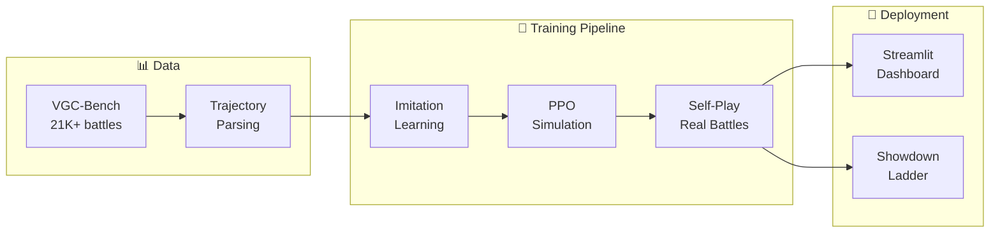
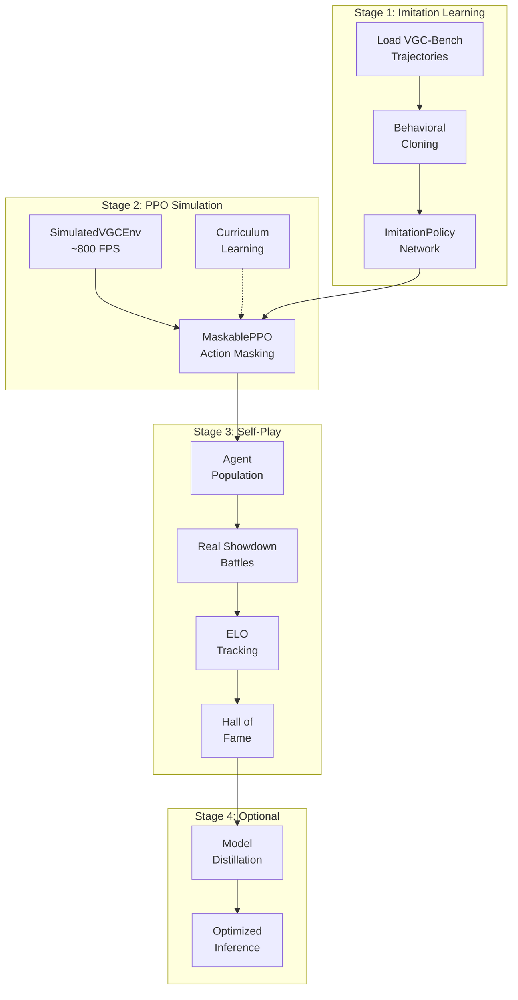
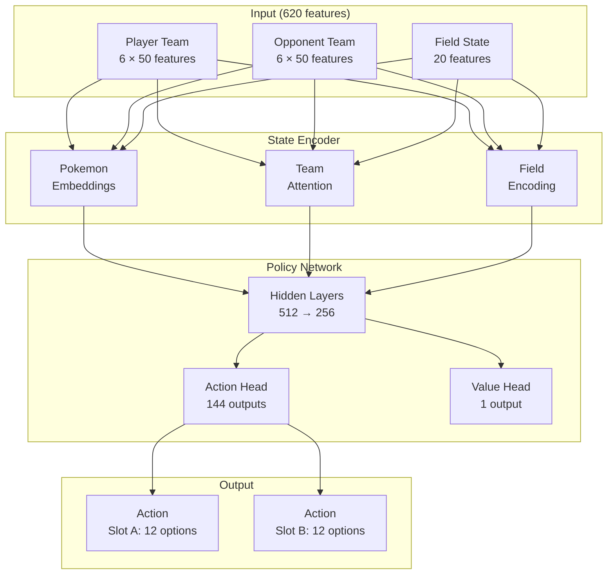
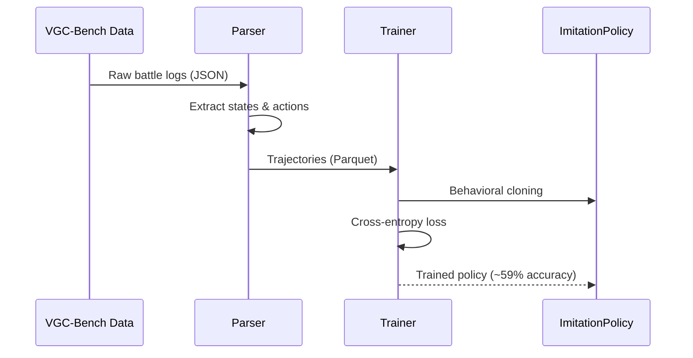
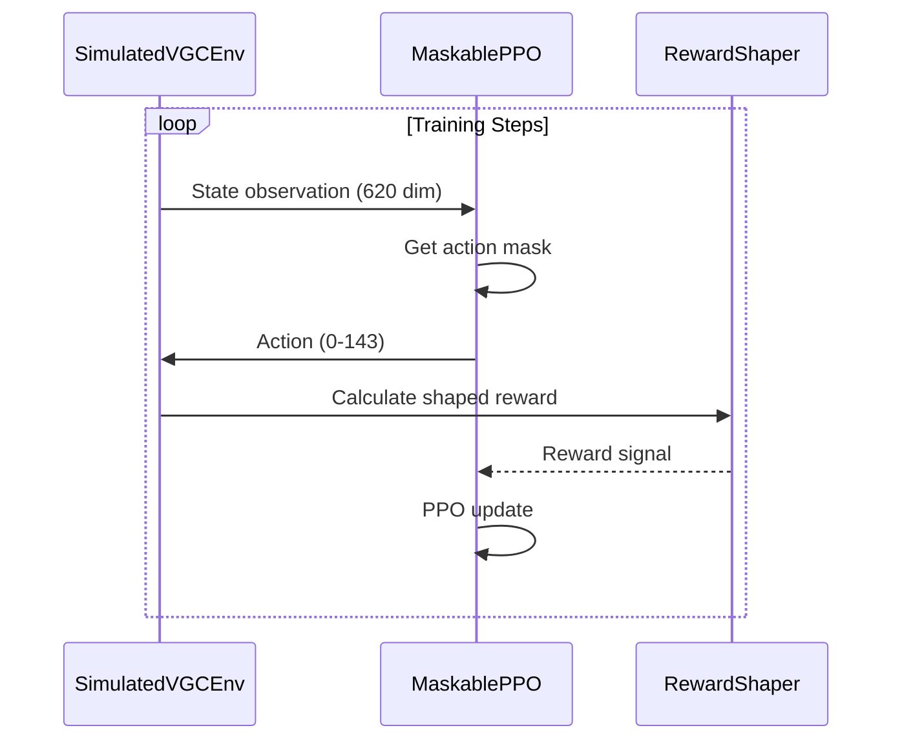
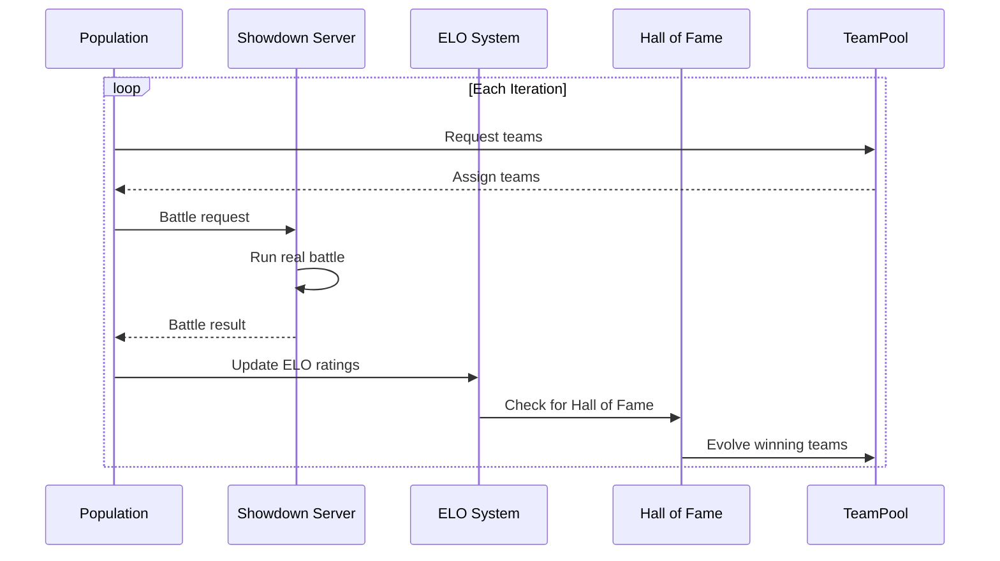
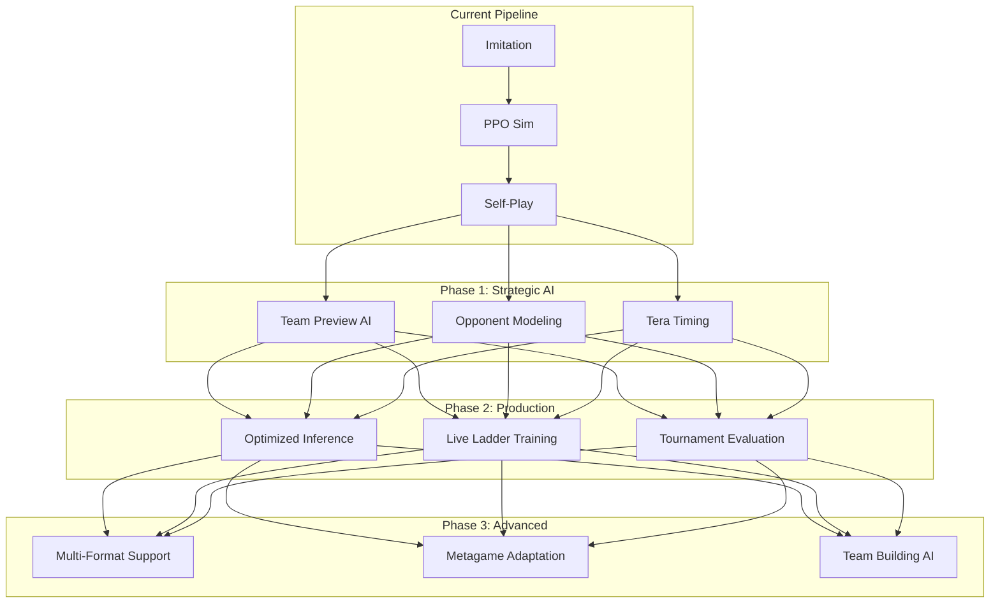

# Pokemon VGC AI Battle Simulator and Team Optimizer

A reinforcement learning-based AI for Pokemon Video Game Championships (VGC) that learns from expert replays, improves through self-play, and battles on Pokemon Showdown.

## 🎯 Overview

This project implements a complete ML pipeline for training a competitive VGC battle AI:



---

## ✅ Current Status

| Component | Status | Description |
|-----------|--------|-------------|
| **Data Pipeline** | ✅ Complete | 21K+ VGC battles parsed to trajectories |
| **Imitation Learning** | ✅ Complete | Behavioral cloning on expert replays |
| **PPO Training** | ✅ Complete | Simulated env (~800 FPS) with action masking |
| **Self-Play** | ✅ Complete | Real Showdown battles with ELO tracking |
| **Team Evolution** | ✅ Complete | Genetic algorithm for team optimization |
| **Streamlit Dashboard** | ✅ Complete | Battle visualization and analytics |
| **Tournament Mode** | ✅ Complete | Best-of-3 evaluation framework |

---

## 🏗️ Architecture

### Training Pipeline Architecture



### Model Architecture



---

## 🚀 Quick Start

### 1. Setup Environment

```bash
cd pokemon-vgc-ai
python -m venv venv
source venv/bin/activate  # Windows: venv\Scripts\activate
pip install -r requirements.txt
```

### 2. Setup Pokemon Showdown

```bash
# Clone in parent directory
cd ..
git clone https://github.com/smogon/pokemon-showdown.git
cd pokemon-showdown
npm install
cp config/config-example.js config/config.js

# Start server
node pokemon-showdown start --no-security
```

### 3. Run Training

```bash
cd pokemon-vgc-ai

# Minimal test (verify pipeline works)
python scripts/run_hybrid_training.py \
    --stages ppo_sim,self_play \
    --ppo-sim-timesteps 2000 \
    --self-play-iterations 2 \
    --self-play-real-battles

# Full training
python scripts/run_hybrid_training.py \
    --stages all \
    --imitation-epochs 20 \
    --ppo-sim-timesteps 100000 \
    --self-play-iterations 50 \
    --self-play-real-battles \
    --use-enhanced-selfplay \
    --evolve-teams
```

---

## 📜 Scripts Reference

### Main Training Script

| Script | Description |
|--------|-------------|
| `scripts/run_hybrid_training.py` | **Main training pipeline** - orchestrates all stages |

#### Usage Examples

```bash
# Stage 1 only: Imitation Learning
python scripts/run_hybrid_training.py --stages imitation --imitation-epochs 10

# Stage 2 only: PPO Simulation
python scripts/run_hybrid_training.py --stages ppo_sim --ppo-sim-timesteps 50000

# Stages 2-4: PPO + Self-Play with real battles
python scripts/run_hybrid_training.py \
    --stages ppo_sim,self_play \
    --self-play-real-battles \
    --use-enhanced-selfplay \
    --evolve-teams

# Full pipeline with all features
python scripts/run_hybrid_training.py \
    --stages all \
    --use-enhanced-selfplay \
    --self-play-real-battles \
    --evolve-teams \
    --mixed-precision \
    --distill
```

#### CLI Arguments

| Argument | Default | Description |
|----------|---------|-------------|
| `--stages` | `all` | Comma-separated: `imitation,ppo_sim,ppo_real,self_play,distill` |
| `--data-path` | `data/processed/trajectories_batched` | Path to trajectory data |
| `--output-dir` | `data/models/hybrid` | Output directory |
| `--continue-from` | None | Path to model to continue training |
| `--imitation-epochs` | 20 | Epochs for imitation learning |
| `--ppo-sim-timesteps` | 100000 | Timesteps for simulated PPO |
| `--ppo-real-timesteps` | 10000 | Timesteps for real Showdown PPO |
| `--self-play-iterations` | 20 | Self-play iterations |
| `--self-play-real-battles` | False | Use real Showdown battles |
| `--use-enhanced-selfplay` | False | Hall of Fame + League system |
| `--evolve-teams` | False | Enable team evolution |
| `--team-pool-size` | 20 | Teams in evolution pool |
| `--battle-timeout` | 60 | Timeout per real battle (seconds) |
| `--max-real-battles` | 5 | Max real battles per iteration |
| `--use-curriculum` | False | Progressive difficulty training |
| `--mixed-precision` | False | FP16 training (2x speedup) |
| `--distill` | False | Compress model after training |

### Utility Scripts

| Script | Description |
|--------|-------------|
| `scripts/start_showdown.sh` | Start Pokemon Showdown server |
| `scripts/run_full_pipeline.py` | Legacy full pipeline script |

---

## 📁 Project Structure

```
pokemon-vgc-ai/
├── config/                         # Hydra YAML configuration
│   ├── default.yaml                # Base config
│   ├── model/                      # Model architectures
│   ├── training/                   # Training presets
│   └── data/                       # Data sources
│
├── src/
│   ├── core/                       # Infrastructure
│   │   ├── config_schema.py        # Typed configurations
│   │   ├── container.py            # Dependency injection
│   │   └── plugins.py              # Plugin architecture
│   │
│   ├── data/                       # Data processing
│   │   ├── parsers/                # Battle log parsing
│   │   │   └── trajectory_builder.py  # Streaming processor
│   │   ├── storage/                # Parquet storage
│   │   ├── augmentation.py         # Data augmentation
│   │   ├── vgc_formats.py          # Multi-format support
│   │   └── monitoring.py           # Quality tracking
│   │
│   ├── engine/                     # Battle engine
│   │   ├── showdown/               # Showdown integration
│   │   └── state/                  # State encoding (620 features)
│   │
│   ├── ml/
│   │   ├── models/                 # Neural networks
│   │   │   ├── imitation_policy.py # Base policy
│   │   │   ├── team_preview.py     # 4-Pokemon selection AI
│   │   │   ├── opponent_model.py   # Action prediction
│   │   │   ├── tera_timing.py      # Tera decision network
│   │   │   └── optimized_inference.py  # <1ms inference
│   │   │
│   │   ├── training/               # Training modules
│   │   │   ├── imitation_learning.py
│   │   │   ├── rl_finetuning.py    # PPO with SimulatedVGCEnv
│   │   │   ├── self_play.py        # Basic self-play
│   │   │   ├── enhanced_self_play.py  # Hall of Fame + League
│   │   │   ├── reward_shaping.py   # Advanced rewards
│   │   │   ├── curriculum.py       # Progressive difficulty
│   │   │   ├── ladder_training.py  # Live ladder training
│   │   │   ├── distillation.py     # Model compression
│   │   │   ├── mixed_precision.py  # FP16 training
│   │   │   └── experiment_tracking.py
│   │   │
│   │   └── team_builder/           # Team optimization
│   │       ├── team.py             # Team/PokemonSet classes
│   │       ├── vgc_data.py         # 100+ Pokemon movesets
│   │       └── evolutionary.py     # Genetic algorithms
│   │
│   ├── eval/                       # Evaluation
│   │   ├── tournament.py           # Best-of-3 matches
│   │   ├── benchmark.py            # Automated testing
│   │   └── metrics.py              # ELO, win rate, etc.
│   │
│   └── app/                        # Streamlit UI
│       ├── main.py                 # Dashboard
│       └── components/
│           └── battle_viz.py       # Battle visualization
│
├── tests/                          # Test suite
│   ├── unit/                       # Unit tests
│   └── integration/                # Integration tests
│
├── data/
│   ├── raw/vgc_bench/              # VGC-Bench dataset
│   ├── processed/trajectories_full/  # Parquet trajectories
│   └── models/                     # Model checkpoints
│
└── scripts/                        # Runnable scripts
```

---

## 🧠 Training Details

### Stage 1: Imitation Learning



**Key Features:**
- Parses 21K+ expert VGC battles
- Outcome-weighted behavioral cloning
- Early stopping on validation accuracy

### Stage 2: PPO Simulation



**Key Features:**
- ~800 FPS training speed
- Action masking prevents invalid moves
- Shaped rewards: KOs, HP differential, momentum

### Stage 3: Self-Play with Real Battles



**Key Features:**
- Real Pokemon Showdown battles
- Population-based training with ELO
- Hall of Fame preserves best agents
- Team evolution via genetic algorithms

---

## 🎮 Streamlit Dashboard

Launch the interactive dashboard:

```bash
streamlit run src/app/main.py
```

### Pages

| Page | Description |
|------|-------------|
| **Home** | Overview and quick stats |
| **Battle Arena** | Fight against AI with custom teams |
| **Team Builder** | Build and optimize teams |
| **Analytics** | Metagame stats and AI performance |
| **Settings** | Configuration and data management |

---

## 📊 Modules Integration Status

### ✅ Integrated in Training Pipeline

| Module | Location | Used In |
|--------|----------|---------|
| ImitationLearning | `training/imitation_learning.py` | Stage 1 |
| SimulatedVGCEnv | `training/rl_finetuning.py` | Stage 2 |
| MaskablePPO | `training/rl_finetuning.py` | Stage 2 |
| SelfPlayTrainer | `training/self_play.py` | Stage 4 |
| EnhancedSelfPlayTrainer | `training/enhanced_self_play.py` | Stage 4 |
| RewardShaper | `training/reward_shaping.py` | Stages 2-4 |
| TeamPoolManager | `training/enhanced_self_play.py` | Stage 4 |
| ExperimentTracker | `training/experiment_tracking.py` | All stages |
| Distillation | `training/distillation.py` | Stage 5 |

### ⏳ Standalone (Future Integration)

| Module | Location | Future Use |
|--------|----------|------------|
| TeamPreviewNetwork | `models/team_preview.py` | Before battles |
| OpponentPredictor | `models/opponent_model.py` | During action selection |
| TeraTiming | `models/tera_timing.py` | Tera decision support |
| FastInferenceEngine | `models/optimized_inference.py` | Production deployment |
| TournamentRunner | `eval/tournament.py` | Model evaluation |
| LadderTrainer | `training/ladder_training.py` | Live ladder training |

---

## 🔮 Future Integration Plans



### Phase 1: Strategic AI Integration
- [ ] Add TeamPreviewNetwork to battle initialization
- [ ] Integrate OpponentPredictor in action selection
- [ ] Use TeraTiming for Tera decisions

### Phase 2: Production Deployment
- [ ] Deploy FastInferenceEngine (<1ms per action)
- [ ] Enable LadderTrainer for live learning
- [ ] Automated tournament evaluation

### Phase 3: Advanced Features
- [ ] Support multiple VGC formats (Reg G, H, 2025)
- [ ] Dynamic metagame adaptation
- [ ] Full team building optimization

---

## 🧪 Testing

```bash
# Run all tests
pytest

# Run with coverage
pytest --cov=src

# Run specific tests
pytest tests/unit/test_state_encoder.py -v
pytest tests/integration/test_training_pipeline.py -v
```

---

## 📈 Metrics

### Training Metrics

| Metric | Description |
|--------|-------------|
| **Win Rate** | % of battles won |
| **ELO** | Rating from matchup history (starts at 1500) |
| **FPS** | Training samples per second |
| **Action Accuracy** | % matching expert actions (imitation) |

### Evaluation Metrics

| Metric | Description |
|--------|-------------|
| **KO Efficiency** | KOs dealt per KO received |
| **Turn Efficiency** | Average turns per win |
| **Tera Usage** | Optimal Tera timing |
| **Switch Rate** | Positioning effectiveness |

---

## 📚 Data Sources

### VGC-Bench Dataset

| File | Format | Battles |
|------|--------|---------|
| `logs-gen9vgc2024regg.json` | VGC 2024 Reg G | 21,480 |
| `logs-gen9vgc2024regh.json` | VGC 2024 Reg H | ~30K |
| `logs-gen9vgc2025regg.json` | VGC 2025 Reg G | ~50K |

**Source**: [cameronangliss/vgc-battle-logs](https://huggingface.co/datasets/cameronangliss/vgc-battle-logs)

---

## 🛠️ Requirements

- Python 3.11+
- Node.js 18+ (for Pokemon Showdown)
- ~4GB disk space (models + data)

### Key Dependencies

```
torch>=2.0
stable-baselines3>=2.0
sb3-contrib>=2.0
poke-env>=0.6
streamlit>=1.28
pandas
numpy
loguru
```

---

## 📄 License

MIT License

## 🙏 Acknowledgments

- [Pokemon Showdown](https://pokemonshowdown.com/) - Battle simulator
- [poke-env](https://github.com/hsahovic/poke-env) - Python interface
- [VGC-Bench](https://huggingface.co/datasets/cameronangliss/vgc-battle-logs) - Battle dataset
- [Stable-Baselines3](https://stable-baselines3.readthedocs.io/) - RL algorithms
